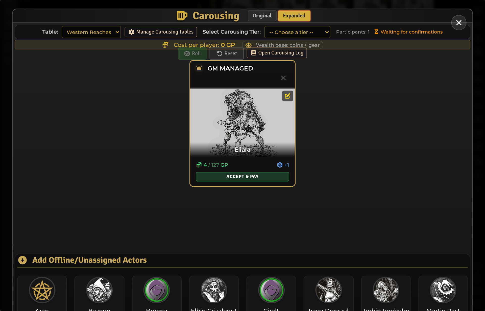

# Carousing

[← Wiki home](Home.md)

Carousing is a shared downtime workflow with two rule modes, editable data,
player-ready result cards, copper-precise costs, and a persistent GM log.

---

## Open it

Use the beer icon on the SDX Tray. The overlay is available when **Enable
Carousing** is on.

The GM assembles and manages the session; players can review/confirm the
characters they own according to the active workflow.



## Choose a mode

**Configure Settings → Shadowdark Extras → Carousing Mode**

| Mode | Model |
|---|---|
| **Original** | Tier/cost and a direct outcome/benefit table |
| **Expanded** | Spending tier, d8-style outcome, d100 benefit/mishap tables, modifiers, XP |

Changing the mode changes the overlay and which editor opens from **Manage
Carousing Tables**.

## Typical session

1. Open the Carousing overlay.
2. Add/select participating characters.
3. Review carried coins and, when relevant, total valued wealth.
4. Choose the available tier/drop and confirm participants.
5. Roll the session.
6. Review each result.
7. In Original mode, use the GM-only **Apply** button for mechanical outcomes.
8. Open the Carousing Log when you need the persistent record.
9. Reset after the session is finished.

The overlay shows whether the percentage-loss base is **coins only** or **coins
+ gear**.

## Money math

All arithmetic is performed in copper, even when displayed as GP/SP/CP.

- `1 gp = 10 sp = 100 cp`;
- a cost such as 5% of 41 gp is 2 gp 5 cp, not a floored 2 gp;
- deduction spends available denominations without silently re-minting the
  entire purse;
- this matters because Shadowdark encumbrance counts coin quantity.

### Wealth base

**Carousing Wealth Base** controls percentage losses:

| Choice | Percentage is based on | Payment comes from |
|---|---|---|
| **Coins only** | GP + SP + CP carried | Coins |
| **Coins + gear** | Coins plus recorded gear value | Coins first |

Gear with no recorded value contributes zero. If a gear-based loss is larger
than the character's coins, SDX creates/increases a zero-slot **Carousing Debt**
item with the exact unpaid amount and history.

## Applying Original-mode outcomes

Original results can include:

- XP;
- Luck;
- percentage wealth loss;
- Renown change;
- narrative consequences.

The result card's GM-only **Apply** button shows an exact preview and confirmation
before committing. Application is idempotent: a second click does not grant the
same result twice, and the card displays an **Applied** badge.

Narrative rewards such as allies, enemies, debts, or bans do not have a safe
universal Shadowdark field. SDX appends the full outcome to the character's
Notes instead of guessing at mechanics.

Expanded mode applies its numeric XP as part of its own roll path and does not
reuse the Original Apply button. Its player-visible benefit and mishap text is
also appended to Notes once, along with the applied XP/Renown summary.

## Carousing Log

The GM-only log is a Journal with one stable page per session. It records:

- participant and roll;
- outcome;
- benefits and mishaps;
- the exact mechanical result applied;
- Expanded XP/Renown summary where relevant.

Pages are found by flags, so renaming the Journal does not orphan the log.
Reopening/backfilling is idempotent and should not duplicate the character-note
entry.

## Editing tables

Open **Manage Carousing Tables**. The editor follows the active mode.

Supported imports include labeled prose and pipe-separated columns:

```text
30 gp | A worthy night of drinking and festivity | +0
```

Depending on the section, columns can represent:

- event tier: roll, cost, description, bonus;
- Original outcome: roll, description, benefit;
- Expanded outcome: roll, mishaps, benefits, d100 modifier, XP;
- benefit/mishap row: roll, description.

The RollTable result range can supply the roll column, so it may be omitted.
Review the imported editor data before saving.

Link only a structurally compatible RollTable. An Original outcome table is not
an Expanded outcome table merely because both contain prose.

## Visibility

The GM can independently show or hide benefit and mishap descriptions from
players. These controls apply both to player-facing chat and to the automatic
Expanded-mode entry written to character Notes, so a hidden outcome is not
silently disclosed on the character sheet. The GM-only Carousing Log retains
the complete result. Costs and required player decisions remain visible when
the workflow needs them.

---

## Troubleshooting

**Reset did nothing.** Update SDX. Current builds use Foundry's deletion operator
correctly and clear session/drop flags while retaining the GM-managed roster.

**Removed participant came back.** Current builds persist key deletion
explicitly. A participant with an unapplied result can remain reachable until
that result is handled.

**Every Expanded row has 0 XP.** A mismatched linked table may have supplied no
usable fields. Current editors warn and keep configured values instead of
overlaying an all-zero parse.

**Outcome changed coins but not XP/Luck.** In Original mode, click **Apply** and
confirm the preview.

**Percentage cost looks different from whole-GP math.** It is intentionally
copper-precise.

---

**Related:** [Character Sheets](Character-Sheets.md) ·
[Settings Reference](Settings-Reference.md) ·
[Compendium Packs](Compendium-Packs.md)
