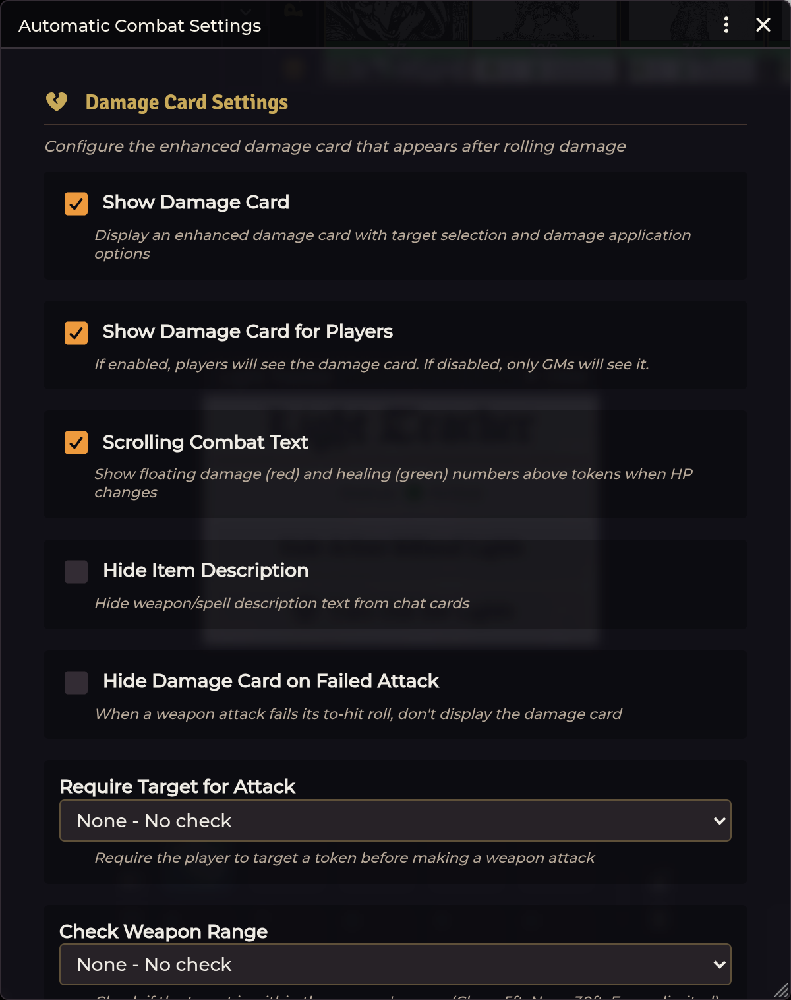

# Combat & Damage

[← Wiki home](Home.md)

Shadowdark Extras adds a post-roll damage workflow, configurable target/range
rules, typed damage processing, scrolling combat text, and item-level attack
automation.

---

## Configure combat once

Open **Configure Settings → Shadowdark Extras → Configure Combat Settings**.

The default is automation-forward: the enhanced card is visible to everyone,
successful damage and configured conditions auto-apply, but SDX does not require
a target or enforce weapon range.

For a confirmation-first table:

1. Turn **Auto-Apply Damage** off.
2. Turn **Auto-Apply Conditions** off if effects also require approval.
3. Optionally enable **GM Only Apply Damage**.
4. Set target/range checks to **Warn**, not Block, until your item ranges and
   scene scale are verified.

## Enhanced damage cards

After a recognized damage roll, the card can show:

- the targeted tokens;
- the damage total and typed components;
- multiplier buttons;
- an Apply button;
- configured effects/conditions;
- GM/player visibility based on settings.

The default multiplier row includes 0, ¼, ½, 1, and 2, plus the card's clear
control. Use it for immunity, resistance, normal damage, and vulnerability
without editing HP manually.

Scrolling combat text displays the final damage or healing result over the
affected token.

### Target selection

SDX uses the user's current targets and, where supported by the card, selected
tokens. Target ownership and actor permission still matter. A player's
cross-owner change can be relayed to the GM.

The **Require Target for Attack** choices are:

| Mode | Behavior |
|---|---|
| **None** | Roll normally with no SDX target check |
| **Warn** | Notify the user but allow the attack |
| **Block** | Prevent the attack until a target exists |

### Range checking

The **Check Weapon Range** modes are also None, Warn, and Block. SDX's quick
range interpretation is:

| Shadowdark range | Distance |
|---|---:|
| Close | 5 ft |
| Near | 30 ft |
| Far | Not capped by this check |

Scene grid scale and token positions must be correct for a meaningful result.

### Untargeting

At the end of the workflow, SDX can keep every target, release dead targets, or
release all targets. The default is **dead**.

---

## Damage types

Configured item damage can be tagged as physical or elemental/other types. The
extended item sheets expose common choices including:

- bludgeoning, slashing, piercing, and generic physical;
- fire, cold, lightning, acid, and poison;
- necrotic, radiant, psychic, and force;
- healing where the item type supports it.

Typed components are processed separately so an actor's resistance, immunity,
or vulnerability can affect the correct part of a mixed roll.

## Weapon Bonuses tab

Open a Weapon item and use the SDX **Bonuses** interface to define behavior that
belongs to that weapon.

### To-hit bonuses

Each entry can contain:

- a flat number or formula such as `2` or `@abilities.dex.mod`;
- requirements;
- **Exclusive**, so it suppresses other applicable entries;
- **Prompt**, so the user decides whether to include it in the roll dialog.

### Damage bonuses

Damage entries use the same formula/requirement model and can carry their own
damage type. Promptable entries are chosen during the workflow.

### Critical bonuses

Configure additional dice and/or a formula that only contributes on a critical
hit. Keep the normal weapon damage in the Shadowdark system fields; use SDX
critical fields for the extra component.

### Effects on hit

Drag effects or conditions into the weapon's on-hit configuration. On a
successful hit, SDX can apply those to the valid target set, respecting the
combat setting for automatic condition application.

## Requirements

Bonus requirements can inspect combat context such as:

- target name;
- ancestry;
- creature type;
- current HP or HP percentage;
- conditions/effects;
- comparison operators such as equals, contains, starts with, or not-equal.

Creature-type checks use the NPC's manual SDX type when set, then the bundled
bestiary name map. See [NPCs & Effects](NPCs-and-Effects.md).

Test one requirement at a time before combining them. A bonus that does not
appear is usually failing a requirement rather than failing to save.

---

## Item Macro triggers

Weapons can execute a stored item macro at specific points:

- before attack;
- hit;
- critical hit;
- miss;
- critical miss;
- equip;
- unequip.

**Run as GM** is available for actions that need elevated permissions. The
macro receives the caster and workflow context. In current versions, `token` is
consistently a Token placeable; use `token.document` for TokenDocument fields
and updates.

Run-as-GM cannot create a token placeable for a scene the GM client is not
rendering. Cross-scene targets are dropped with a warning rather than silently
substituting a different token.

## NPC attacks

SDX supplies an NPC Attack item sheet with:

- attack count;
- to-hit value;
- damage formula and type;
- Shadowdark range choices;
- description and source tabs.

NPC Feature, NPC Spell, and NPC Special Attack sheets add Activity and/or Macro
configuration for creature abilities that need the same automation concepts as
player spells.

## Combat settings quick reference

| Setting | Default |
|---|---|
| Show card / show to players | on / on |
| Auto-apply damage / conditions | on / on |
| GM-only Apply | off |
| Target requirement / range check | none / none |
| Hide on failed attack | off |
| Scrolling combat text | on |
| Untarget | dead targets |

---

## Troubleshooting

**Damage was applied twice.** Check for another damage automation module and
turn off one auto-apply path. Also check whether an item macro applies damage in
addition to its configured SDX damage.

**Bonus never appears.** Remove its requirements temporarily, then add them
back one at a time. Verify the target has the expected SDX creature type.

**Block mode rejects a valid ranged attack.** Confirm the item range and scene
grid scale. Use Warn if you use house distances that do not match Close/Near.

**Apply button is visible but a player cannot change the target.** The target
may not be owned and no active GM may be available to authorize the change.

**NPC attack count is missing.** Update SDX. Current builds coerce Shadowdark
4.x's numeric `attack.num` before enriching the display.

---

**Related:** [Spell Automation](Spell-Automation.md) ·
[NPCs & Effects](NPCs-and-Effects.md) · [Animation FX](Animation-FX.md)
