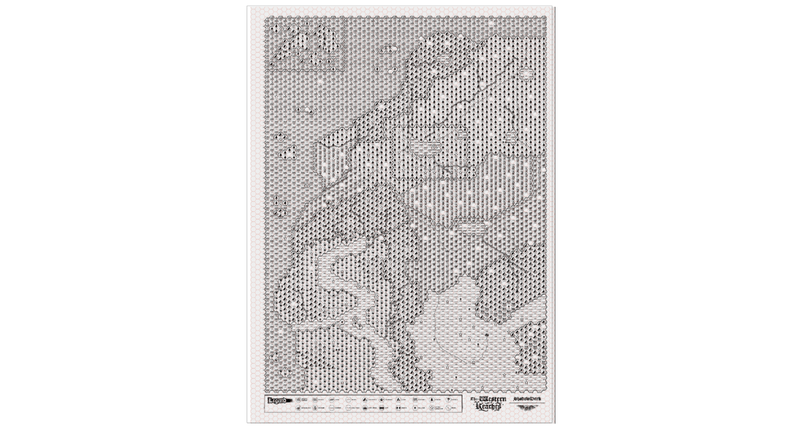
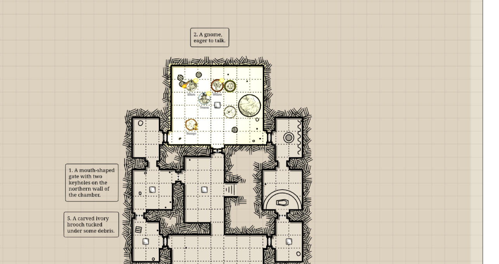

# Hexcrawls & Dungeons

[← Wiki home](Home.md)

The SDX Tray contains a full prep workflow: format a hex scene, paint or
generate terrain, place POIs, key exploration data, add fog and coordinates,
then generate linked settlements or playable dungeons. A separate Dungeons tab
paints or procedurally creates square-grid interiors.

---

## Hex workflow

### 1. Format the map

Open **Hexes → Format Map** before placing terrain.

Choose the orientation and requested width/height. Current formatting sizes the
scene to the chosen grid dimensions with whole far-edge hexes; Foundry's normal
staggered half-hex behavior remains at the appropriate top/bottom edge.

Formatting changes scene dimensions/grid. Duplicate an existing keyed scene
before reformatting it.

### 2. Choose a tile source

The Hexes tab separates:

- bundled default tiles;
- bundled colored tiles;
- custom tiles;
- symbol/POI assets.

Custom tile dimensions and placement are saved per client through the tray.
Choose one consistent source/dimension set before bulk generation.

### 3. Paint or generate

Click a terrain tile and paint hex cells manually, or expand the procedural
generator:

- seed;
- map dimensions/current formatted scene;
- biome/elevation/vegetation parameters;
- Generate;
- Clear generated tiles.

A seed makes the procedural layout repeatable with the same inputs. Clear only
targets tiles marked as SDX-generated; it is still destructive and asks for
confirmation unless an authorized API caller forces it.

### 4. Place POIs

Switch to Symbols and place point-of-interest art. The tray tool rail adds:

- undo/redo;
- scale down/up;
- rotate left/right;
- horizontal mirror.

POI scale is remembered per client. Decor painting uses the same quick transform
controls.

### 5. Flatten

**Flatten Hexagons** consolidates the painted result for a lighter finished
scene. Treat it as a commit step: keep a duplicate if you expect to repaint
individual tiles later.

---

## Hexplorer and keyed hex data

Enable **Hex Tooltip / Hexplorer** on a hexagonal scene. The Edit Hex dialog has
two tabs.

### Details

| Field | Purpose |
|---|---|
| Show to Players | Whole-record visibility |
| Image | Hex illustration |
| Hex Name / Zone / Zone Color | Region identity |
| Terrain / Travel | Table-facing movement description |
| Notes | Individual text rows with player visibility |
| Features | Keyed locations with discovered state |

### Exploration

| Field | Purpose |
|---|---|
| Status | Unexplored/exploration progress |
| Cleared / Claimed | Campaign state |
| Reveal Radius | `-1` world default, `0` current cell, `1+` rings |
| Reveal Cells | Extra comma-separated grid offsets; Alt-click can add |
| RollTable UUID | Table rolled on entry/travel |
| Chance | 1–100%; blank/default is always |
| First Time Only | Prevent repeat entry rolls |

Hex records are scene-specific and stored in SDX's internal hex-data Journal.
Do not edit that Journal manually.

## Procedural hex content

Hex context tools can generate:

- settlements with named NPCs, shops, taverns, factions, relations, quests, and
  a Watabou map link/configuration;
- text-only keyed dungeons;
- playable dungeon Scenes.

Generated settlements/dungeons create or update Journal pages, add a feature to
the hex record, and register the content for cross-referenced quests.

### Playable hex dungeon

The playable flow asks for dungeon type and size, then:

1. creates and views a new square-grid Scene;
2. runs the procedural dungeon geometry;
3. generates narrative rooms from the actual placed-room graph;
4. creates an Overview plus one Journal page per room;
5. places numbered SDX pins linked to those room pages;
6. records the Scene/Journal back on the source hex;
7. returns the GM to the previous viewed Scene.

This gives room text and map geometry the same room count and adjacency.

## Hex Fog

The fog tool hides/reveals exploration cells. The default movement reveal radius
is one ring. Per-hex records can override it and can name additional cells.

Right-click the Hex Fog tool to choose optional shaders. **Enable Fog Effects**
is off by default; leave shaders off on low-power clients while still using the
underlying reveal system.

## Coordinates

The globe tool cycles coordinate display states:

- hidden;
- margin/axis labels;
- labels in cells;
- Shadowdark zine mode.

**Configure Coordinates** controls fonts, colors, outline, opacity, label size,
numeric/letter axes, modifier key, and click-label duration.

Zine mode uses staggered `000/100/200` column headings with two-digit rows and
skips the cropped edge column on hex-column maps. This is designed to align with
printed zine keys.

## Solo Hex Mode

The compass tool enables the module's solo exploration flow on supported hex
scenes. It works with Hexplorer/fog data; turn it off before doing broad GM map
edits so movement does not advance exploration unexpectedly.

---

## Dungeon Painter

The Dungeons tab is square-grid oriented. Choose assets for:

- room/floor tiles;
- interior walls;
- doors;
- outer walls;
- stairs;
- decor.

Useful controls include:

- paint tiles or doors;
- no-Foundry-walls mode;
- wall shadows;
- curved walls;
- auto-rebuild walls;
- flatten current elevation Level.

Players only see this tab when **Allow Players to Paint Dungeons** is on, and
their changes are committed through the connected GM.

## Procedural dungeon generator

Expand **Procedural Dungeon** and choose:

| Control | Examples |
|---|---|
| Layout | Rooms & Corridors, Caves, Mixed, Classic/rot.js |
| Biomes | Random/selected room themes |
| Rooms / density / branching | Layout scale and connectivity |
| Room size | Small-to-large bias |
| Stairs Up / Down | Generated transition markers |
| Clutter / decor lights | Dressing density |
| Walls | Texture, color, width, shadows, curved cave boundaries |
| Seed | Repeatable layout |

Generation operates on the active Scene and current elevation Level. It clears
only SDX-generated documents at that level before rebuilding, then creates
floors, walls, doors, biome props, stairs, decor, lights, and Regions according
to the selected options.

The public API hard-caps especially expansive values such as rooms, stairs, and
clutter. See [Developer API](Developer-API.md).

## Biomes and decor

Open the Biome Editor to:

- enable/disable built-in biomes;
- add custom biome definitions;
- override built-in keys;
- reset custom data.

The Decor tray accepts:

- individual files;
- folders;
- URLs allowed by the UI;
- imported Dungeondraft object packs.

Use **Manage Dungeondraft Decor Packs** to preview, enable, hide, and maintain
those packs.

## Multi-level dungeons

On Foundry v14 elevation Levels, generation and flattening respect the current
Level. SDX can create:

- per-level generated documents;
- `defineSurface` Regions;
- `changeLevel` stair Regions;
- level-aware decor;
- template/effect elevation metadata.

Switch to the intended Level before every generation call. A stair graphic does
not become a working transition until its Region links the correct two Level
IDs.

---

## Troubleshooting

**5×5 became a larger map.** Update SDX and format again on a duplicate scene;
older format logic added buffer cells.

**Generated tiles use the wrong dimensions.** Reformat the scene and confirm
the active tile set before generation.

**Hex tooltip button is disabled.** The active scene is not using a supported
hex grid.

**A hex entry RollTable does not fire.** Confirm its UUID, chance, first-only
state, and that the token actually entered/traveled through that grid cell.

**Dungeon content and map room counts differ.** Use the playable hex-dungeon
flow, which derives text from placed geometry, rather than generating text and
map independently.

**Generation changed the wrong elevation.** Activate the desired Level first
and restore from your duplicate if needed.

---

**Related:** [Map Generators](Map-Generators.md) ·
[Journal Tools & Pins](Journal-Tools-and-Pins.md) ·
[Developer API](Developer-API.md)
