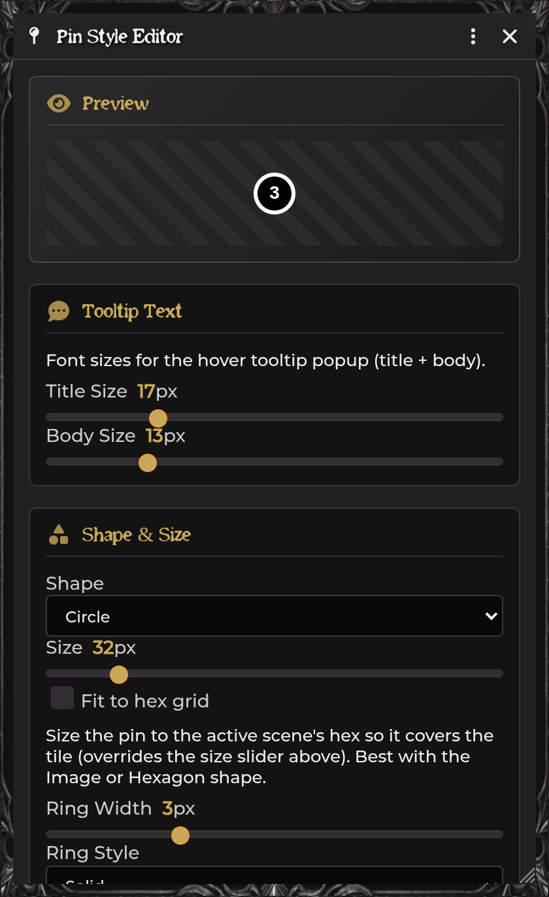

# Journal Tools & Pins

[← Wiki home](Home.md)

SDX connects campaign text to the canvas through character journals, notes on
placeable objects, styled journal pins, folders, map-note conversion, and
read-aloud narration.

---

## Character Journal Notes

With **Enable Journal Notes** on, a Player's Notes tab becomes a small
multi-page journal.

Use the page sidebar to create and navigate entries. The editor supports normal
ProseMirror formatting plus quick blocks for:

- information;
- warning;
- quest;
- loot;
- NPC.

The content remains actor data. Disabling the enhanced UI does not intentionally
delete the saved notes, but back up important actor data before changing note
systems.

## Notes on placeables

With **Enable Notes on placeables and Notes tab in tray** on, configuration
windows for these documents gain a Notes control:

- Token;
- Tile;
- Wall;
- Ambient Light;
- Ambient Sound.

Write rich text and save. The tray's **Notes** tab lists the current scene's
annotated objects. From there:

- expand/collapse the note;
- pan to the object;
- rename the note label;
- toggle player visibility;
- delete the note.

This is attached metadata, not a Journal Entry. Deleting the placeable also
removes its note.

## Journal pins

The pin tool creates an SDX canvas marker optionally linked to:

- a Journal;
- a specific Journal page;
- an unlinked tooltip/label.

The Pins tab can:

- search;
- pan or ping;
- bring players to the location;
- open/edit the pin;
- copy/paste style;
- duplicate;
- make GM-only or player-visible;
- require line of sight;
- remove or delete.

## Pin Style Editor

Edit one pin or the world defaults. Options include:

- Font Awesome icon, image, or custom text;
- icon/text color and tint;
- background and border;
- circle, square, pointy hex, or flat hex;
- size and scale;
- **Fit to hex grid**;
- label and tooltip content;
- title/body font sizes;
- player visibility and line-of-sight behavior;
- display-name source.

### Pin name source

| Choice | Display name |
|---|---|
| **Auto** | Journal/page → tooltip title → canvas label |
| **Journal/Page** | Linked document name |
| **Tooltip** | Tooltip title |
| **Canvas Label** | Marker label |

Auto ignores placeholder names such as “New Pin” when a better source exists.

### Pixel-perfect hit testing

For irregular transparent images, enable **Pixel perfect on Pins**. The alpha
threshold decides which pixels count as clickable:

- lower values accept more translucent pixels;
- higher values require more opaque pixels.

This is experimental and costs more than simple shape hit testing.

## Pin folders

The GM can create nested folders in the Pins tab:

- drag pins into/out of folders;
- drag folders to reorder or nest;
- collapse/expand;
- choose color;
- choose a Font Awesome or image icon.

Folder scope can be:

| Scope | Definition appears |
|---|---|
| **Scene** | Only on the current scene |
| **World** | On every scene, marked with a globe |

Pins remain scene-owned even inside a world folder. A world folder is a shared
organizational definition, not a way to move a pin between scenes.

Search reveals matches inside collapsed folders.

## Convert Foundry Map Notes

Use **Notes→Pins** for all Map Notes on the current scene, or the convert control
on one note.

The new pin keeps:

- position;
- Journal/page link;
- text label;
- icon path, tint, and size.

Choose a target folder and whether to delete the original Note. Deletion is
optional so you can compare the converted result first.

## Generated room pins

The playable hex-dungeon builder creates one pin per generated room, linked to
the matching room Journal page. This is the preferred path when the room number
on the map and the room key must stay synchronized.

## Journal narration

When **Enable Journal Narration** is on, rendered Journal blockquotes receive a
narration toolbar. Put read-aloud text in a blockquote, render the page, and use
the added control to present it.

## Easy Reference

The ProseMirror Easy Reference menu inserts live NPC, Item, RollTable, check, and
dice syntax. See [Easy Reference](Easy-Reference.md).

---

## Troubleshooting

**Placeable Notes button is absent.** Enable the setting and reload. Foundry
v14 uses the DocumentSheetV2 header-controls hook.

**A note saved blank.** Reopen after updating SDX; current builds read the real
ProseMirror field path.

**Pin has an unhelpful name.** Set Pin Name to Auto or Tooltip and provide a
real title.

**World folder is empty on another scene.** Expected: the folder definition is
world-wide, but pins stay on their source scene.

**Map Note conversion duplicated markers.** You kept the original Notes.
Delete them after verifying the converted pins, or use the conversion dialog's
delete-originals option next time.

**Image pin is hard to select.** Try pixel-perfect mode or a lower alpha
threshold; for map-sized hex art, use Fit to hex grid.

---

**Related:** [Hexcrawls & Dungeons](Hexcrawls-and-Dungeons.md) ·
[Easy Reference](Easy-Reference.md) ·
[Character Sheets](Character-Sheets.md)
