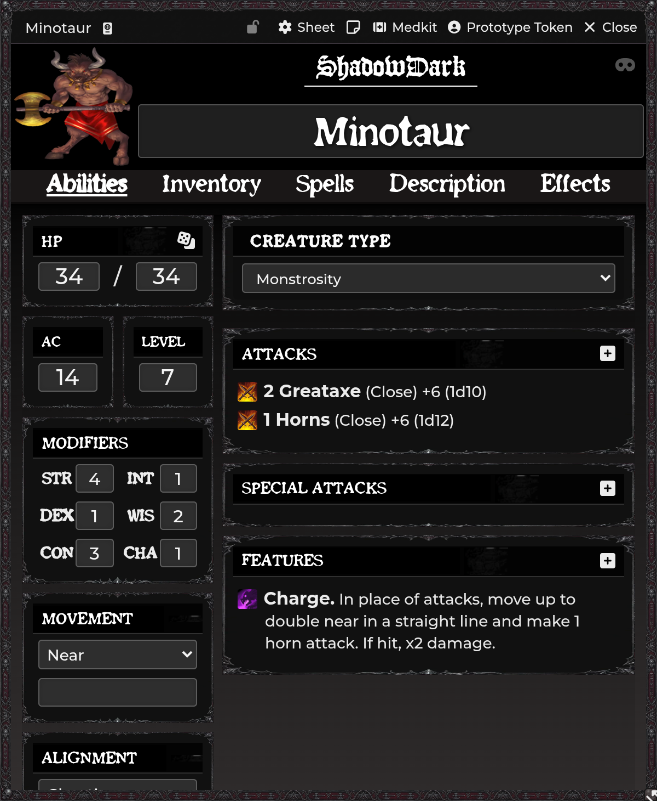

# NPCs & Effects

[← Wiki home](Home.md)

SDX gives NPCs a fuller inventory, explicit creature types, typed attacks,
Activity-driven abilities, quick conditions, mysterious casting, and a reusable
effects library.

---

## NPC inventory

With **Enable NPC Inventory Tab** on, ordinary NPC sheets gain:

- item list;
- quantities;
- treasure;
- GP/SP/CP;
- used inventory slots;
- create/edit/delete controls.

Party actors are excluded because their dedicated Party sheet has its own shared
inventory and treasury.

## Creature types

With **Enable NPC Creature Type** on, NPC sheets show a type selector. Types can
drive:

- weapon bonus requirements;
- spell/effect gating;
- macros and API integrations;
- quick GM reference.

Open **Manage Creature Types** to add custom choices.

### Effective type resolution

SDX resolves a creature type in this order:

1. the NPC's manual type override;
2. the bundled bestiary name map;
3. blank when neither exists.

The map lets stock bestiary creatures participate without editing every actor.
A manual choice wins, which is useful for reskinned or homebrew creatures.

The read-only API exposes both effective and raw-name-map lookups. See
[Developer API](Developer-API.md).

## NPC item sheets

### NPC Attack

The SDX NPC Attack sheet includes:

- number of attacks;
- attack bonus;
- damage formula;
- damage type;
- Close/Near/Far choices;
- Description and Source.

The attack count accepts numeric or free-form values. Current builds preserve
Shadowdark 4.x's numeric multi-attack display.

### NPC Feature and NPC Spell

These use Activity, Description, and Macro tabs. They can configure damage,
healing, saves, effects, auras, templates, summons, and item macros using the
same model as player spells.

### NPC Special Attack

Special Attacks receive Activity, Description, and Macro tabs for abilities that
do not fit a normal weapon line.

See [Spell Automation](Spell-Automation.md).

## Mysterious Casting

The GM sees a mask toggle in an NPC sheet header:

- **off:** rolls/cards appear normally;
- **on:** public output is replaced by the configured mysterious-casting text
  while the GM retains the hidden details.

The state is intentionally in-memory, so it is a tactical reveal mode rather
than permanent actor data. Toggle it again after a reload if needed.

Edit the public text with **Mysterious Casting Message**.

## Quick conditions

NPC sheets receive the same themed quick-condition toggles as Player sheets.
Condition changes create/remove the actor's real effects; the chosen theme only
changes presentation.

## Effects & Conditions settings

Open **Configure Effects**. The current dedicated policy is **Silenced**:

| Item class | Default when Silenced |
|---|---|
| Spell / NPC Spell | blocked |
| Scroll | allowed |
| Wand | allowed |
| Potion | always allowed |

Enable Scroll/Wand blocking if your table treats those activations as requiring
speech. Potions are not blocked because drinking does not require speech.

## Effects library

`shadowdark-extras.pack-sdxeffects` contains reusable ActiveEffect documents.
Drag them into:

- weapon on-hit effects;
- spell/Potion/NPC Activity slots;
- aura or template effects;
- actor effects.

The module supports predefined advantages/disadvantages, spell-related
modifiers, and special effects such as Glassbones where included by the pack.
Inspect an effect before applying it to homebrew actors.

## Damage response

Effects can alter typed damage through resistance, immunity, or vulnerability.
An effect can also be marked **break on damage**, causing it to end on the
bearer's next HP loss. Clearing or applying this marker is available to item
automation and the public API.

## Auras

Auras are configured on the source item but processed against NPC/Player token
geometry. Disposition, line of sight, range, elevation, and turn trigger all
affect membership. See [Spell Automation](Spell-Automation.md#aura-effects).

---

## Troubleshooting

**Creature-type bonus does not trigger.** Check the actor's effective type and
the bonus operator/value. A renamed homebrew actor may not match the bundled map
until you set a manual type.

**Mysterious mode turned off after reload.** Expected; it is an in-memory
encounter mode.

**NPC inventory appears on a Party actor.** Update/reload SDX and confirm the
actor has the Party flag created by the Party actor workflow.

**Silenced blocks the wrong item class.** Review the three toggles in Configure
Effects. Potions remain usable by design.

**Aura triggers more than once.** Keep one active GM applier and update to a
version with native Region membership/deduplication fixes.

---

**Related:** [Combat & Damage](Combat-and-Damage.md) ·
[Spell Automation](Spell-Automation.md) ·
[Compendium Packs](Compendium-Packs.md)
