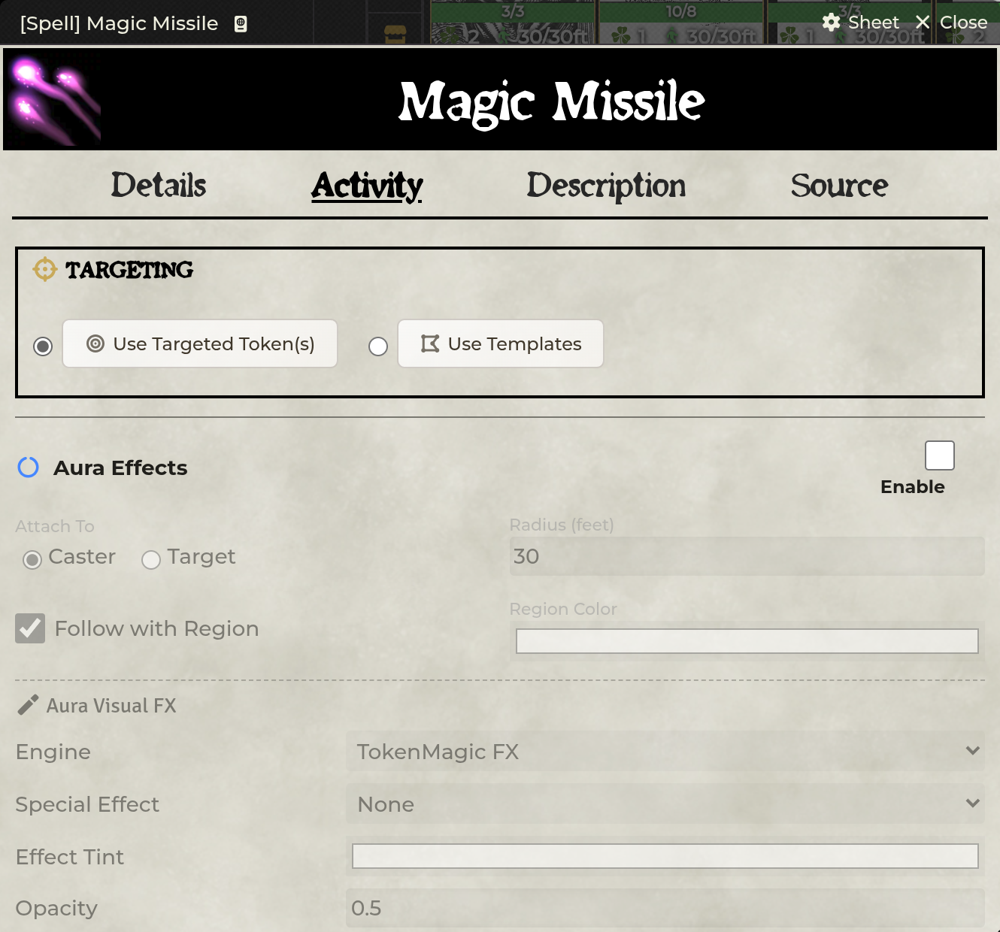

# Spell Automation

[← Wiki home](Home.md)

The **Activity** tab turns a Spell, Scroll, Wand, Potion, NPC Feature, or NPC
Spell into a declarative workflow: choose targets, roll saves and damage, apply
effects, track duration, summon creatures, give items, and run macros.

---

## Before configuring an item

1. Enable **Enhance Spells** and reload.
2. Open the item from a world actor or editable world item.
3. Use the **Activity** tab.
4. Save after changing each major section.
5. Test with one caster and one target before adding templates, auras, or
   multiple effects.

Scrolls and Wands can reference a Spell by UUID. If the referenced source moves
or is deleted, inherited behavior cannot resolve. Medkit can refresh stale
owned copies.

## Targeting

### Targeted tokens

The normal mode uses Foundry's current target set. Decide whether the item
affects all valid targets, one random target, or a prompted selection where the
section offers that choice.

### Measured templates

Template targeting creates a measured template when the item is cast:

| Option | Examples |
|---|---|
| Shape | Circle, cone, ray, rectangle |
| Size | Distance/width appropriate to the shape |
| Placement | Caster-origin or interactive placement, depending on configuration |
| Cleanup | End of turn, after rounds, after seconds, or manual |
| Visuals | Texture, opacity, TokenMagic filter stack |
| Effects | On creation, enter, leave, or turn-boundary behavior |

On Foundry v14, SDX pairs templates with native Regions. The Region is the
automation surface for containment, turn triggers, effects, and elevation-aware
behavior.

The **Edit TMFX Stack** control opens the TokenMagic filter editor for a full
stack rather than a single filter.

### Template saving throws

A configured template save can roll against the tokens caught when the template
is created. Set:

- ability or target defense;
- DC/formula;
- success behavior, such as half or no damage;
- which targets receive linked effects.

“Target Defense” lets an ability use the target's defense value when the item
needs a contested/defense-style calculation rather than a fixed DC.

## Aura effects

An aura remains centered on its source or chosen target. Configure:

- radius;
- ally, enemy, or all disposition;
- line-of-sight requirement;
- triggers: enter, leave, source turn start/end, target turn start/end;
- damage/healing and saving throw;
- effects/conditions;
- Sequencer animation;
- TokenMagic filters for affected tokens.

Aura processing is GM-authoritative to avoid every client applying the same
effect. A headless/no-canvas GM does not process canvas geometry; another
canvas-capable GM must be present.

## Damage and healing

SDX supports three authoring styles:

| Mode | Use it for |
|---|---|
| **Basic** | Dice plus bonus, with simple level scaling |
| **Formula** | A custom Roll formula using supported actor/target variables |
| **Tiered** | Different formulas for level bands |

Common variables include caster level and abilities; target variables are
available where a target exists. Add a damage type so resistance/immunity logic
can process the result correctly.

Additional controls can include:

- a requirement formula;
- critical multiplier;
- every-level or every-other-level scaling;
- healing type;
- per-target roll/application choices.

Avoid JavaScript in a Roll formula. Use Foundry Roll syntax and supported data
paths; SDX evaluates formulas as rolls, not arbitrary code.

## Effects and conditions

Drag effect documents into normal and critical slots. For each group, choose:

- target or self;
- all, random, or prompted selection;
- optional requirement;
- normal or critical outcome.

Effects can also be marked to break when their bearer next loses HP. The public
API exposes the same break-on-damage primitive for integrations.

## Focus spells

With **Enable Focus Spell Tracker** on:

1. A successful focus spell starts a tracked focus entry.
2. Linked effects are associated with that focus instance.
3. The caster makes Shadowdark's native focus check when required.
4. On success, configured per-turn damage/healing can apply.
5. On failure or manual end, the focus entry and linked effects are cleaned up.

**Auto-Roll Focus on Turn** fast-forwards each active check at the caster's
turn. It is off by default.

The Token Toolbar and selected sheet surfaces can display active focus icons.
Do not model the same ongoing spell as both a focus entry and an unrelated
duration entry unless you intentionally want two lifecycles.

## Duration tracking

Non-focus ongoing spells can be tracked by rounds or time. Configure:

- duration;
- turn-start or turn-end trigger;
- per-turn damage/healing;
- effect reapplication if needed;
- manual/automatic expiry.

Duration icons appear in the Token Toolbar when enabled. Their controls can end
the tracked instance.

## Summoning

Each summon profile can define:

- Actor UUID;
- quantity;
- placement behavior;
- token lifecycle;
- automatic deletion when the spell expires.

Use a world/compendium actor with a stable UUID. Interactive placement depends
on portal-lib and the current scene. Summoned token cleanup uses the tracked
spell/expiry state, so deleting that state by hand can orphan a token.

## Item giving

An item-giving entry grants a configured Item to the caster after the required
cast result. Use it for conjured weapons, temporary tools, or spell-created
resources. Decide separately how and when the granted item should be removed.

## Alignment

Spell configuration can carry alignment-related rules where the item's behavior
depends on caster or target alignment. Treat blank as no gating; test homebrew
labels against the values your Shadowdark actors actually store.

## Item Macros

Spell-like items can run macros on:

- cast;
- success;
- critical success;
- failure;
- critical failure.

Run-as-GM is intended for authoritative document changes. The macro context
includes caster, item, result, targets, and token/scene data when resolvable.
Current behavior keeps `token` as a Token placeable on both local and GM paths.

Do not also configure declarative damage/effects if the macro applies the same
payload, or the target will receive it twice.

## Scrolls, Wands, and Potions

- **Scrolls** resolve their referenced spell and consume/use the physical item
  according to the system workflow.
- **Wands** can track uses when **Enable Wand Uses** is on and can contain one or
  more spell references.
- **Potions** use the SDX Potion sheet with Details, Activity, Description, and
  Macro tabs.

The Animation FX panel on Scroll and Wand Activity tabs supports the same
preview, sound, and override controls as a Spell.

## Medkit

Medkit compares owned automation against registered source packs:

- Spells can be replaced from their matching source;
- Scrolls and Wands retain their physical item data while SDX enhancement flags
  are refreshed from the referenced spell;
- the UI previews what will change;
- the GM can scan all world actors from settings.

---

## Troubleshooting

**Activity tab is missing.** Enable **Enhance Spells** and reload. Confirm the
item type is one SDX extends.

**Template appears but nothing happens.** Confirm it has a paired Region, valid
effect triggers, and caught tokens at the correct elevation.

**Aura does not process.** A canvas-capable active GM must be connected. Check
radius, disposition, line of sight, scene, and elevation.

**Scroll/Wand panel is blank.** Its spell UUID is missing or stale. Re-link the
spell or update the item through Medkit.

**Run-as-GM affects the wrong token or none.** Keep the caster on the scene the
GM client can resolve. Cross-scene placeables are intentionally not guessed.

**Per-turn focus damage happens before the check.** Update SDX and refresh the
owned spell; current behavior applies it only after a successful native focus
check.

---

**Related:** [Combat & Damage](Combat-and-Damage.md) ·
[Animation FX](Animation-FX.md) · [Compendium Packs](Compendium-Packs.md)
