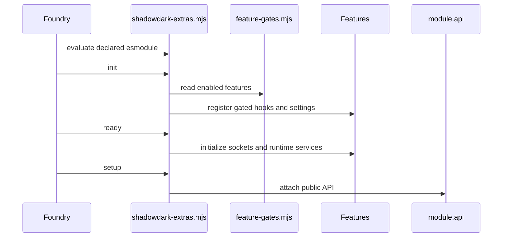

# Module Runtime Architecture

Shadowdark Extras is a Foundry VTT module for Shadowdark. `module.json` declares Foundry 13 as the minimum and 14 as verified, Shadowdark 3.0.0 as the minimum system version, required module relationships, shipped CSS, language data, compendium packs, and four declared esmodules. The primary runtime entrypoint is `scripts/shadowdark-extras.mjs`.

## Composition model

The entrypoint is deliberately a composition root, not a feature implementation. It imports feature owners, invokes their `init*`/`register*` functions in fixed locations, installs document and sheet registrations, exposes compatibility exports, and builds `module.api`. A feature belongs in its owner directory rather than in the root.

This shows the lifecycle ownership and not a literal promise ordering for every callback.

## Ordering is behavior

`registerFoo()` calls install hooks where they are invoked. Moving a call in `scripts/shadowdark-extras.mjs` changes registration order even when callback code is unchanged. The repository protects this with `dev/snapshots/registrations.json` through `npm run snapshot:registrations`. Add new registration calls at the appropriate phase boundary; do not reorder existing calls as cleanup.

The root uses `init` for settings, patches, templates, sheet classes, and early registration; `ready` for system-dependent initialization, socket handlers, journals, and migrations; and `setup` to create `game.modules.get("shadowdark-extras").api`. The ready block first returns for non-Shadowdark systems.

## Feature control plane

Most registrations and runtime actions use `FEATURE_IDS` and `isFeatureEnabled` from `scripts/settings/feature-gates.mjs`. The feature manager is described in [Feature Management](feature-management.md). Disabling a feature requires reload and is intended to remove hidden/background behavior, not merely hide its controls.

## Manifest integration boundaries

The manifest requires `socketlib`, `lib-wrapper`, `sequencer`, `portal-lib`, and TokenMagic; recommends JB2A and psfx. Runtime modules must still guard optional integrations. The module ships global scripts for GSAP/PixiPlugin, JSZip, and fonts, then module code conditionally uses them. See [Animation FX](../animation/animation-fx.md), [Scene Portability](../scene/scene-portability.md), and [Maphub](../maps/maphub.md).

## Focused checks

- `npm run snapshot:registrations` checks static registration identities and source order.
- `dev/tests/feature-manager-startup-ownership.test.mjs` characterizes gated startup ownership.
- `dev/tests/split-module-load.test.mjs` proves extracted module imports/load surfaces.
- Use live Quench after structural moves; static checks cannot prove Foundry runtime behavior.

For compatibility state and migrations, see [Persistence and Migrations](persistence-and-migrations.md).