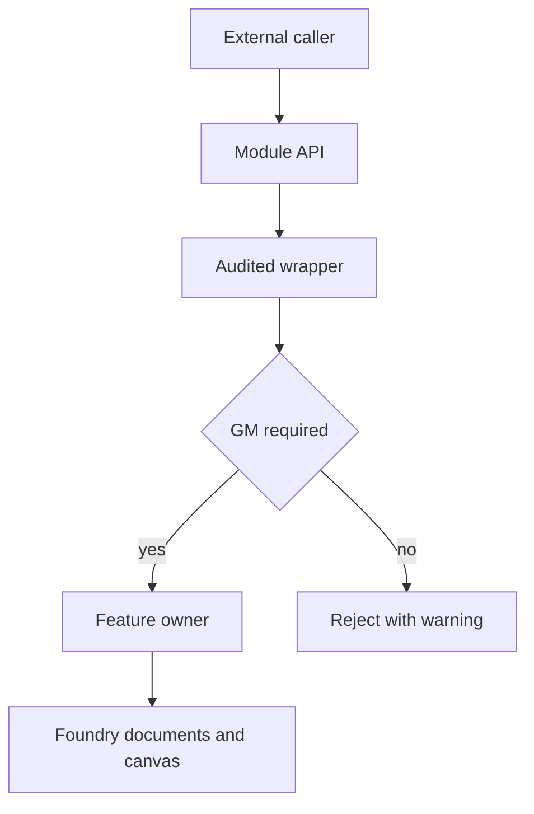

# Public API and Automation Surface

At Foundry `setup`, `scripts/shadowdark-extras.mjs` attaches an API object to `game.modules.get("shadowdark-extras").api`. This is distinct from JavaScript module exports: it is the cross-module and automation surface available from a live world.

## Construction and authority

The root uses `gmOnly(name, fn)` for write-capable operations and `audited(name, fn)` to log caller-stack context before dispatch. Read operations are generally available to callers; mutating map, biome, hex, or maintenance operations are normally both audited and GM-only. Do not bypass these wrappers when adding a public mutation.

The API includes template functions, development helpers, WebP/compendium maintenance, creature-type reads, focus-spell operations, Medkit pack/world helpers, and dungeon/biome/hex/hexcrawl/region operations. `SDX.dev.castSpell()` intentionally remains present when Spell Activity is off because it calls the system-native `actor.system.castSpell`.

This shows the standard authority path for a mutating API operation.

## Ownership-aware removal

API keys have feature owners. Root cleanup removes a key only when none of its owners remains enabled; this prevents disabling one feature from deleting a co-owned API. When exposing a new operation, identify all feature gates that actually own it and update the root ownership/removal logic.

## Declared esmodule compatibility

The root preserves old declared-esmodule names through re-exports: `getCustomLightSources`, `executeItemMacro`, and `hasItemMacro`. Internal feature modules should import their owner module, not reintroduce a feature-to-root dependency. Public map operations are detailed in [Hex Exploration](../hex/hex-exploration.md) and [Dungeon Generation](../dungeon/dungeon-generation.md); template operations live in `scripts/api/templates.mjs`.

## Validation

`npm run snapshot:api` checks exported names, while `dev/tests/export-surface.test.mjs` compares the exported surface against `origin/main`. Neither proves signatures or behavior. Use `dev/tests/api-templates.test.mjs`, the narrow consumer tests, and live inspection of `Object.keys(game.modules.get("shadowdark-extras").api).sort()` for behavior changes.