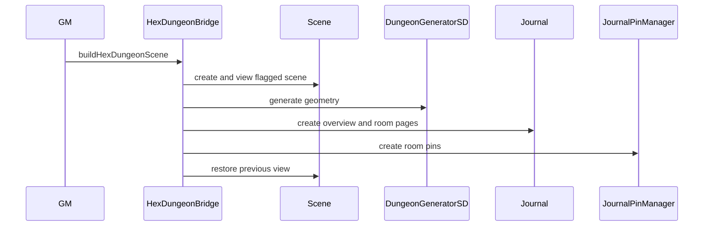

# Dungeon Generation and Painting

`DungeonGeneratorSD.mjs` owns generated geometry and imports painter selections/context, cave algorithms, biome assignment, and decor generation. Its settings include room/density/branching/size/symmetry/stairs/style and visual options. It waits for canvas/document readiness because it writes to the active Scene.

Dungeon painter, cave, biome, decor, multi-level, and region modules own distinct responsibilities: tiles/painting, cave layout/loops, enabled/custom biome definitions, levels/context, and generated regions/surfaces/decor. The Dungeon Painter gate and socket must be initialized before tray asset loading so player tile requests have a handler.

## Hex dungeon bridge

`buildHexDungeonScene({hexLabel, hexKey, typeKey, sizeKey})` is a GM-facing public API operation. It creates a flagged Scene, views it, generates geometry, derives room adjacency/directions from rooms actually placed, generates narrative room content, creates a Journal plus room pages, creates SDX journal pins at room centers, then restores the previous Scene non-fatally.

Geometry is authoritative; narrative is generated only from actual placed rooms. Metadata links `Scene.flags.shadowdark-extras.hexDungeon`, a matching journal flag, original hex key, and pin page IDs. This consumes the [Journal Pins](../journal/journal-pins.md) API and [Hex Exploration](../hex/hex-exploration.md) data model.

**Validate:** `npm test -- dev/tests/dungeon-generator.test.mjs dev/tests/dungeon-level-context.test.mjs dev/tests/hex-dungeon-persistence.test.mjs`.