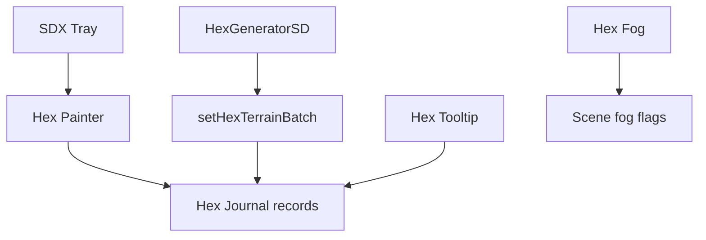

# Hex Exploration, Content, and Fog

Hex exploration is split by responsibility: coordinates, tooltip/persistent records, fog, painter, content generation, Solo Hex Mode, and procedural terrain generation. The root initializes coordinates, tooltip, and fog independently under their feature gates; the Tray exposes painter and exploration controls.

## Durable data

Hex records live in a Journal named `__sdx_hex_data__` at `flags.shadowdark-extras.hexData[sceneId][hexKey]`. Characterized defaults include name, zone, terrain, travel, exploration, cleared, claimed, reveal settings, roll-table fields, visibility, features, and notes. Low-level `saveHexRecord` writes supplied records verbatim, so normalization belongs to higher-level callers. Fog is separate Scene state: `hexFogEnabled` and `hexFogEffect` flags.

`HexGeneratorSD` uses elevation/vegetation simplex-noise layers and imports painter asset/configuration while writing terrain through tooltip batch persistence. It does not own the record store. Content registry/generator and settlement tools supply exploration content; Solo Hex Mode adds exploration-triggered behavior.

GM/player visibility and mutation authority are feature-specific and must be kept distinct from a mere tooltip display. For bridge-created dungeon scenes, see [Dungeon Generation](../dungeon/dungeon-generation.md).

**Validate:** `npm test -- dev/tests/hex-dungeon-persistence.test.mjs dev/tests/hex-coordinates.test.mjs dev/tests/hex-coordinates-lazy-build.test.mjs`.