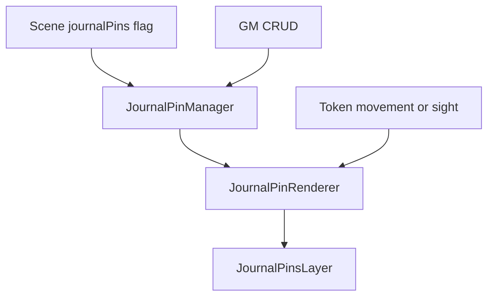

# Journal Pins

Journal pins are custom Scene data, not Foundry native Scene Notes. `JournalPinManager` reads/writes `flags.shadowdark-extras.journalPins`; each record carries location, journal/page linkage, label, folder/sort, style, visibility, tooltip fields, flags, and schema version. CRUD is GM-only. Updates deep-merge expanded `flags.*` and `style.*` patches so sibling fields survive.

`initJournalPins()` registers a custom layer after `walls`, drag/drop, ready socket handlers for pan/ping, canvasReady load, teardown cleanup, Scene-flag reload, and visibility-only refresh on token movement/sight. `JournalPinsLayer` loads the active Scene’s records; style is intentionally a leaf module. Dynamic imports break manager/renderer cycles only when a live redraw is necessary.

Do not equate pins with native Notes: [Scene Portability](../scene/scene-portability.md) currently collects native Notes, while custom pins are Scene flags. Tray, marching, hex fog, and hex-dungeon creation are consumers. Optional TokenMagic integration must remain guarded.

Concurrent rebuilds are correctness-sensitive: a later asynchronous renderer rebuild must win and no destroyed texture may remain attached. Visibility/permissions also belong to renderer state, not only to the creation UI.

**Validate:** `npm test -- dev/tests/journal-pin-update.test.mjs dev/tests/journal-pin-rebuild-race.test.mjs dev/tests/journal-pin-interactions.test.mjs dev/tests/journal-pin-tmfx-adapter.test.mjs dev/tests/pin-style-editor.test.mjs`.