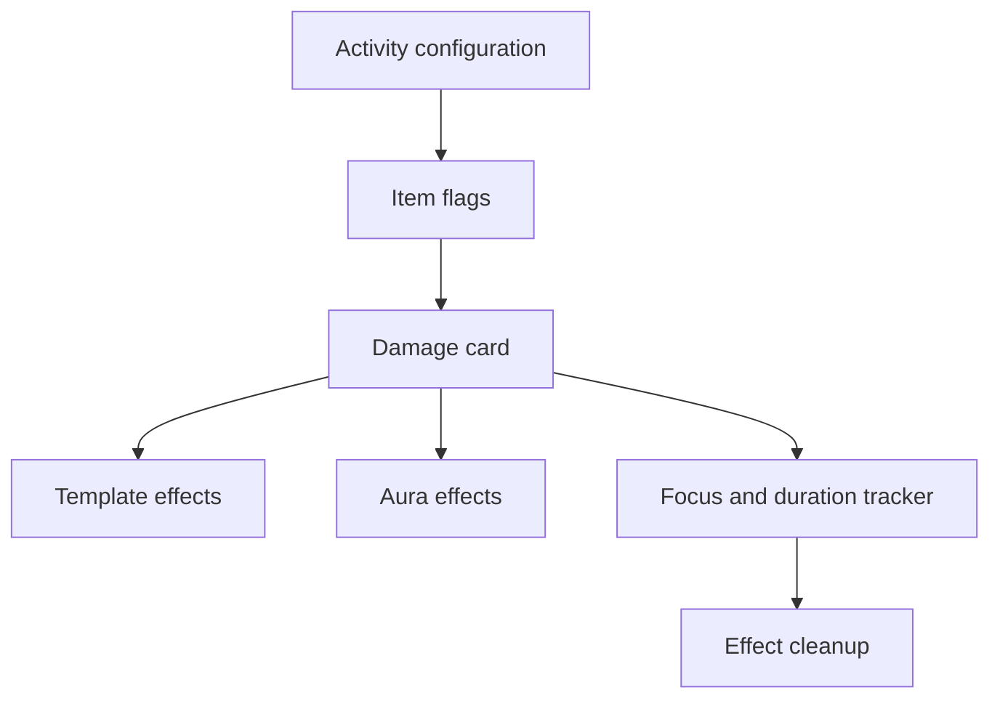

# Spell Activity, Effects, and Item Macros

Spell/scroll/wand sheet enhancements write activity configuration consumed later by the chat-card pipeline. Relevant flag families include `spellDamage`, `summoning`, `itemGive`, `targeting.template`, `templateEffects`, `auraEffects`, `itemMacro`, and `flags.shadowdark-extras.alignment`. Configuration belongs in `scripts/item-sheets/*`; execution belongs in effects and card owners.

## Effect lifecycle

`FocusSpellTrackerSD.mjs` tracks focus/duration spells from chat and combat/document events. `TemplateEffectsSD.mjs` owns template geometry and triggers; `AuraEffectsSD.mjs` owns persistent aura geometry, movement/turn state, optional LOS/Sequencer/TokenMagic behavior, and cleanup. Aura movement records old position in `preUpdateToken`, processes in `updateToken`, and clears duplicate state on combat advance. No-canvas clients stand down safely.

## Macro authority

`item-macro-engine.mjs` reads native macro flags first and legacy `flags.itemacro.macro.command` second. `executeItemMacro()` and spell-specific execution paths centralize context and authorization. A `runAsGM` player sends actor/token UUID context to the GM socket; the handler verifies sender and OWNER permission, rehydrates documents, and preserves an explicit `token: null` so it does not substitute a same-actor token on the GM’s unrelated scene.

`migrateLegacyItemMacros()` is GM-only and idempotent: legacy command data is copied only where native `macroCommand` is missing. It is part of the ready-time compatibility chain described in [Persistence and Migrations](../architecture/persistence-and-migrations.md).

**Validate:** `npm test -- dev/tests/phase53-lane-c-effects.test.mjs dev/tests/itemacro-migration.test.mjs dev/tests/condition-hooks.test.mjs`.