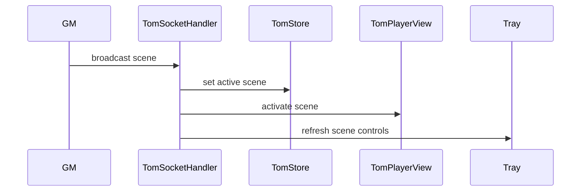

# Theatre of the Mind

`TomSD.initialize()` registers helpers/settings and establishes ready, actor-update, and chat-render hooks. At ready it initializes `TomStore`, runs `TomMigrationService.migrate()`, then initializes `TomSocketHandler` when player view is enabled. TOM is separately feature-gated from its editor, player view, navigation, and video overlays.

`TomStore` caches serialized `TomSceneModel` objects in a `foundry.utils.Collection`. Persistent settings are `tom-dataVersion`, `tom-scenes`, and `tom-folders`; runtime-only state includes active scene, overlays, and slideshow sequence. Store writes serialize back through `game.settings.set` and listens for setting updates.

The module socket routes scene, stop, arena token/asset, transition, overlay, and ruler messages. Actor updates only react to HP changes and dynamically load player-view code to update matching arena tokens. TOM refreshes Tray controls through dynamic import, preserving the [Tray](../architecture/tray-and-cross-feature-ui.md) as UI owner.

**Validate:** `npm test -- dev/tests/tom-background.test.mjs dev/tests/tray-app-bindings.test.mjs`; validate broadcast/player view in a live multi-client world.